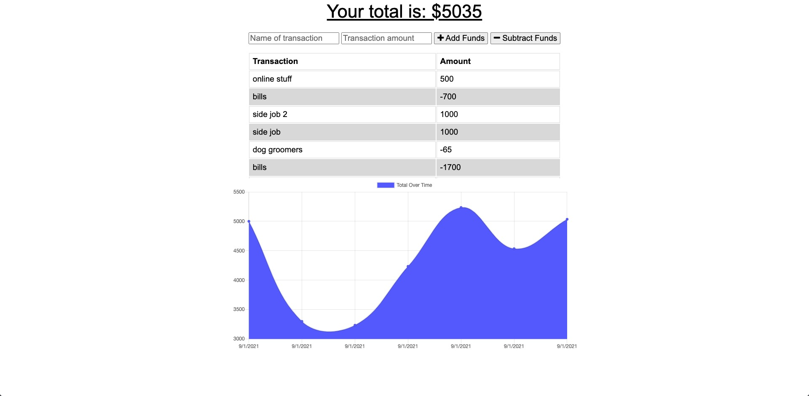
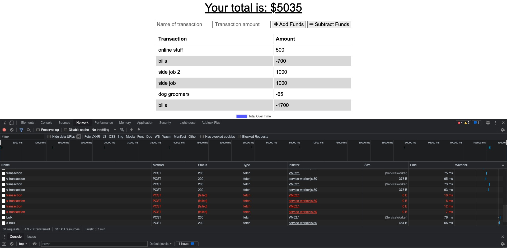
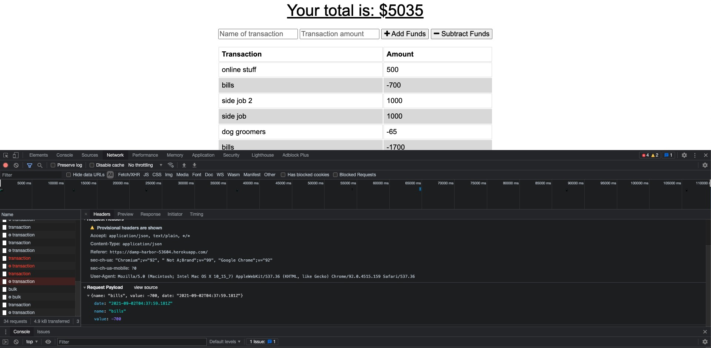

# molina-pwa-challenge

  

  ## Description
  
  This is an app that helps a user keep track of their budget. The user can add funds or subtract funds. The app has offline functionality that will add the transactions the user inputs while offline once they have regained connection.

  ## Deployed App URL: 
  https://damp-harbor-53604.herokuapp.com/

  ## Github URL:
  https://github.com/jmol721/molina-pwa-challenge/tree/main


  ## Table of Contents

  * [Installation](#installation)

  * [Screenshots](#screenshots)

  * [Questions](#questions)

  ## Installation

  To install necessary dependencies, run the following command:

  ```
  npm install
  ```

  ## Screenshots
  

  

  

  ## Questions

  If you have any questions about the repo, contact me directly at jmolina721@gmail.com. You can find more of my work at [jmol721(https://github.com/jmol721/).
